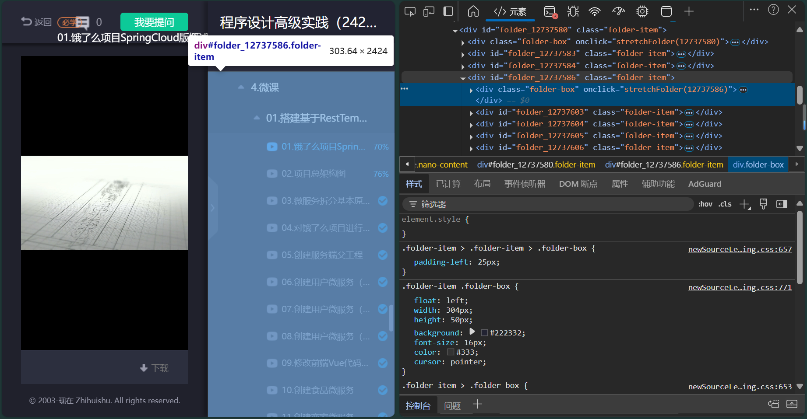
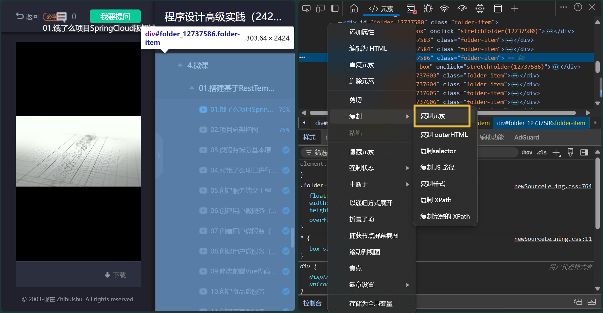
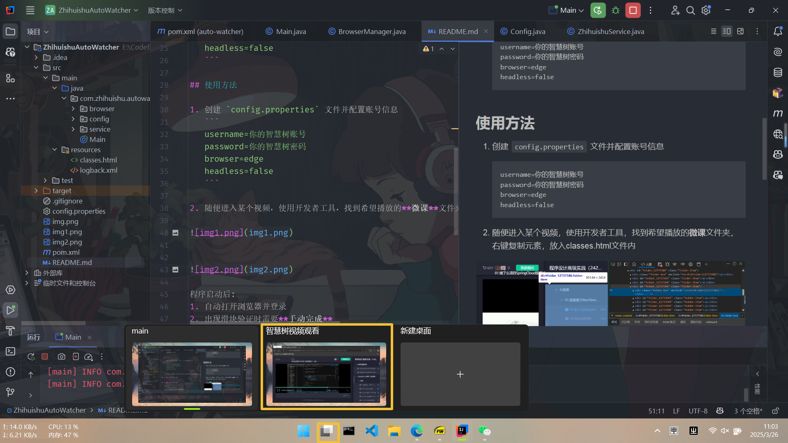

# 智慧树自动观看工具

一个基于Selenium的Java自动化工具，用于自动观看智慧树平台上的视频课程。

## 主要功能

- 自动登录智慧树平台
- 支持手动完成滑块验证
- 自动播放视频并等待完成
- 自动切换到下一个未完成的视频
- 支持视频卡住时自动刷新页面
- 可配置浏览器类型和播放选项

## 系统要求

- Java 8 或更高版本
- Maven 3.6 或更高版本
- Edge、Chrome 或 Firefox 浏览器

## 使用方法

1. 创建 `config.properties` 文件并配置账号信息
   ```
   username=你的智慧树账号
   password=你的智慧树密码
   browser=edge
   headless=false
   courseId=播放课程ID
   ```
- 课程Id获取
  - 登录智慧树，进入课程页面，查看课程的url链接，格式为： ```https://wenda.zhihuishu.com/stu/courseInfo/studyResource?courseId=xxxxxx``` 
    xxxxxx即为对应的courseId。

2. 随便进入课程的某个视频，使用开发者工具，找到希望播放的**微课**文件夹，右键复制元素，放入classes.html文件内






程序启动后:
1. 自动打开浏览器并登录
2. 出现滑块验证时需要**手动完成**
3. 自动开始播放未完成的视频
4. 保持电脑运行，程序会自动完成后续操作

建议将浏览器窗口放到其他桌面运行，这样不影响正常使用，不要关闭浏览器窗口。



## 注意事项

- 本工具仅用于教育和学习目的
- 滑块验证需要手动完成以避免被系统标记为机器人
- 请确保计算机不会进入睡眠模式
- 建议在有稳定网络连接的环境中使用
- 视频播放过程中请勿关闭浏览器窗口

## 日志

程序运行日志保存在 `logs` 目录中，可用于排查问题。